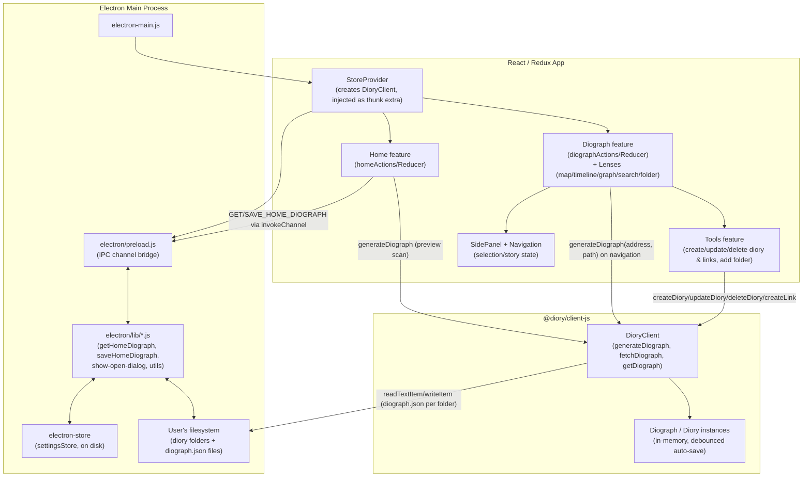

# High-level app flow

Snapshot as of 2026-07-27 — re-derive from code if this looks stale, don't trust it blindly (see `AGENTS.md`).

Electron main hosts filesystem/settingsStore access behind IPC (`preload.js` + `electron/lib/`). The React/Redux app has one feature module per concern (home, diograph, tools, lenses, sidePanel/navigation). All diograph reading/writing/mutation funnels through the single `DioryClient` instance, which owns the actual filesystem I/O and auto-save behavior — Redux never touches files directly, it only reflects `DioryClient`'s in-memory `Diograph` objects.