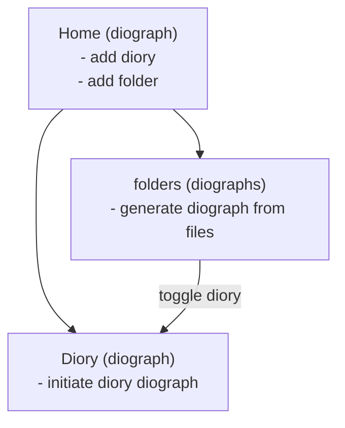

# Diograph model

Snapshot as of 2026-07-27 — re-derive from code if this looks stale (see `AGENTS.md`).

**Flow:** connect folders (`addHomeFolder`) → `folders` list → browse into one → select a diory → **take-to-diory** tool (`toggleHomeDiory`, `src/react/features/tools/actions/takeToDiory/`) toggles it as a link into `diory` (the home story) — it's linked, not moved or duplicated.

Both `diory` and `folders` are themselves diories (everything in this model is a diory, keyed by id) — Home is just the container holding exactly these two.